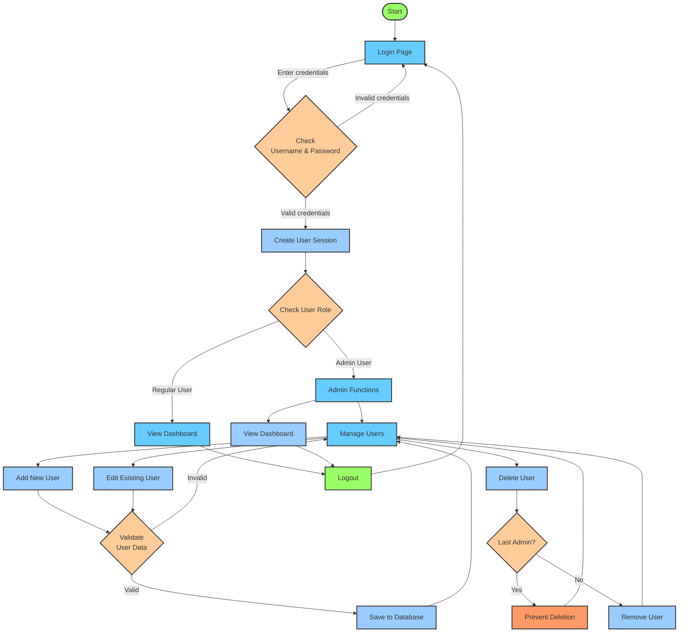

# Greenhouse Management System - Authentication Process

Below is a simplified diagram of how the authentication and user management system works:

## Simplified Explanation for Non-Technical Users

### User Login Process

1. **Starting Point**: A user visits the greenhouse monitoring system
2. **Login Page**: The system presents a login screen requesting username and password
3. **Credential Check**: The system verifies the entered credentials against the database
   - If the credentials are invalid, the user returns to the login page
   - If the credentials are valid, the system creates a secure session for that user

### Access Based on Role

1. **Role Check**: The system determines what level of access the user should have
   - **Regular Users** can only view the dashboard and monitoring data
   - **Admin Users** can both view data and manage system users

### Admin Capabilities

When logged in as an administrator, the user can:

1. **View the Dashboard**: See all greenhouse environmental data
2. **Manage Users**: Access the user management interface
   - **Add New Users**: Create accounts for additional staff members
   - **Edit Users**: Update information for existing users
   - **Delete Users**: Remove user accounts when no longer needed

### Security Safeguards

The system includes several important security features:

1. **Validation**: All user information is checked for validity before saving
2. **Admin Protection**: The system prevents deletion of the last administrator account
3. **Session Management**: User sessions are securely maintained and can be ended by logging out

### Session Expiration

For additional security:

1. **Automatic Timeout**: If inactive for an extended period, the session expires
2. **Manual Logout**: Users can explicitly log out when finished
3. **One-Device Limit**: Each account can only be logged in from one device at a time

This authentication flow ensures that greenhouse data remains secure while providing appropriate access to authorized personnel based on their responsibilities.
