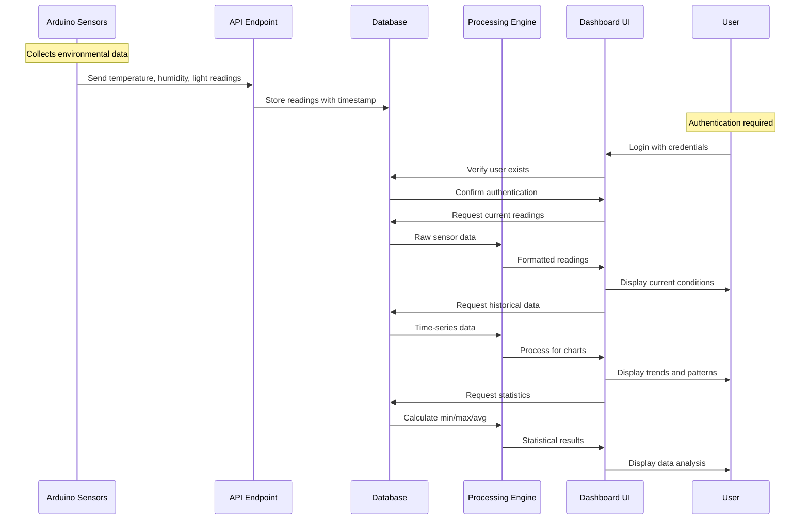

# Greenhouse Management System - Data Flow Explanation

This document explains how environmental data moves through the greenhouse management system, from sensors to visualization.

## Visual Data Flow

## How Data Flows Through The System

### 1. Data Collection Phase

- **Arduino Sensors** placed throughout the greenhouse continuously monitor the environment
- Every few minutes, sensors take **readings** of:
  - Temperature (in °C)
  - Humidity (in %)
  - Light levels (in lux)
- The Arduino device packages these readings together and sends them to the system

### 2. Data Storage Phase

- The system receives the sensor readings through a special access point (API endpoint)
- Each reading is tagged with the exact time it was collected
- All readings are stored in a secure database, building a historical record
- The database organizes readings chronologically for easy retrieval

### 3. Data Access Phase

- Staff members must log in with their username and password
- The system checks if they are authorized to access the greenhouse data
- After successful login, the user arrives at the dashboard
- The dashboard immediately requests the most recent readings from the database

### 4. Data Processing Phase

- Raw readings from the database are processed for display
- The system calculates key statistics like minimums, maximums, and averages
- Historical data is prepared for visual representation in charts
- Readings are compared against optimal ranges to determine status indicators

### 5. Data Visualization Phase

- Processed data is displayed on the user's dashboard in real-time
- Current conditions appear on dedicated cards with easy-to-read indicators
- Historical trends are shown in interactive charts that can be adjusted
- Statistical analysis is presented to help understand environmental patterns

## Non-Technical Explanation of Data Security

Think of the greenhouse monitoring system like a secure journal of your greenhouse conditions:

1. **Writing in the Journal**: Arduino sensors are like diligent assistants who write down greenhouse conditions every few minutes

2. **Keeping the Journal Safe**: The database is like a locked journal where all these notes are kept in chronological order

3. **Journal Access Key**: The login system is like having a key to access the journal - only those with the right key can read its contents

4. **Reading the Journal**: The dashboard is like a special way of reading the journal that makes all the information easy to understand at a glance

5. **Journal Insights**: The processing engine is like having a helper who reviews the journal and highlights important patterns and summaries

By securing access to the system with usernames and passwords, we ensure that only authorized personnel can view sensitive information about your greenhouse environment. This protects your agricultural operations while still providing convenient access to those who need it.
