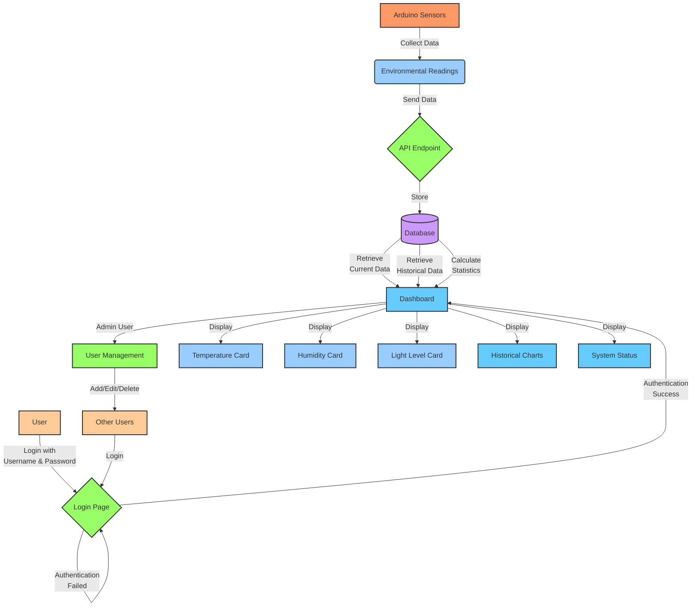

# Greenhouse Management System - Process Flowchart

Below is a flowchart that illustrates how the greenhouse management system works from data collection to visualization, including the new security layer:

## Explanation of the Flow

### 1. Data Collection
- **Arduino Sensors** placed in the greenhouse continuously monitor environmental conditions
- Sensors collect **Temperature**, **Humidity**, and **Light Level** readings
- These readings are sent to the system through an **API Endpoint**

### 2. User Authentication
- Users must **Login** with their username and password to access the system
- The system verifies credentials against the user database
- After successful authentication, users are directed to the **Dashboard**
- Failed login attempts return to the login page

### 3. Data Storage and Retrieval
- All sensor readings are stored in a **Database** with timestamps
- The system retrieves the most recent readings for real-time display
- Historical data is accessed for trend analysis and charting
- Statistical calculations (min/max/avg) are performed on stored data

### 4. Dashboard Visualization
- Users view current environmental conditions on dedicated cards
- Historical trends are displayed in interactive charts
- System status information shows connection state and uptime

### 5. User Management (Admin Only)
- **Admin users** can access the User Management interface
- Admins can add new users, edit existing users, or delete users
- Each user has assigned permissions (admin or regular user)
- Regular users can only view dashboard data, not manage users

## Security Layer

The entire system (except for the sensor data submission API) is protected by authentication. This ensures that:

1. Only authorized personnel can view sensitive greenhouse data
2. User management functions are restricted to administrators
3. Data manipulation is tracked to specific user accounts
4. Environmental information remains secure from unauthorized access

## Data Flow Summary

1. **Collection**: Sensors → API → Database
2. **Processing**: Database → Calculations → Visualization
3. **Access**: User → Authentication → Dashboard
4. **Management**: Admin → User System → User Accounts
